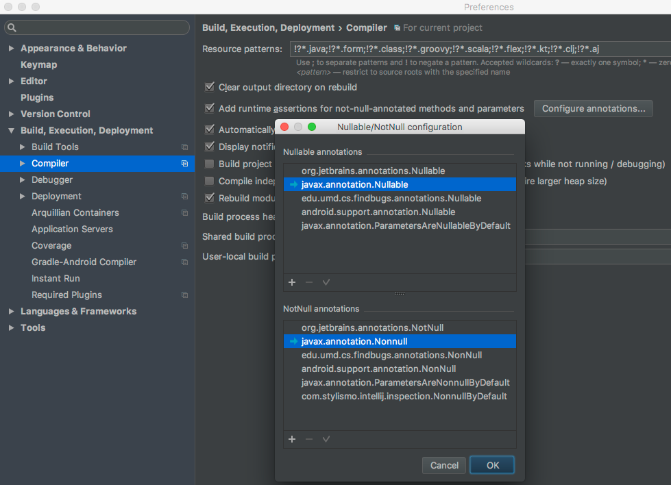

# IntelliJ IDEA nullability annotations inspection

Reports fields, parameters and return values of methods which do not have a nullability annotation, 
like **@NotNull** or **@Nullable**.<sup>[1](#fn1)</sup>

Quick fixes are presented to add one of the annotations to the elements with a problem.

When your project uses *default annotations* like **@ParamsAreNonnulByDefault**<sup>[1](#fn1)</sup>
by means of JSR305' ```javax.annotation.meta.TypeQualifierDefault```, a quick fix will be presented to apply 
the annotation to the current package by adding the annotation to the ```package-info.java```.
If a ```package-info.java``` does not exist yet it will be created automatically.


An example of your custom *default annotation* for your project could be something like this:
```java
package com.stylismo.intellij.inspection;

import static java.lang.annotation.RetentionPolicy.*;

@Documented
@Nonnull
@TypeQualifierDefault({
        ElementType.FIELD,
        ElementType.METHOD,
        ElementType.PARAMETER,
})
@Retention(RUNTIME)
public @interface NonnullByDefault {
}
```

Applying this **@NonnullByDefault** annotation to a package will result in all fields, methods and parameters to be 
non-null, unless an element is annotated with one of the registered **@Nullable** annotations.

Only annotations registered with IntelliJ will be suggested in the quick fixes.
Go to ```Preferences | Build | Compiler | Configure annotations ...``` to register your own.




[1](): 
Any nullability annotation can be used, like JSR-305, JetBrains' or your own as long as you configure them in IDEA.
