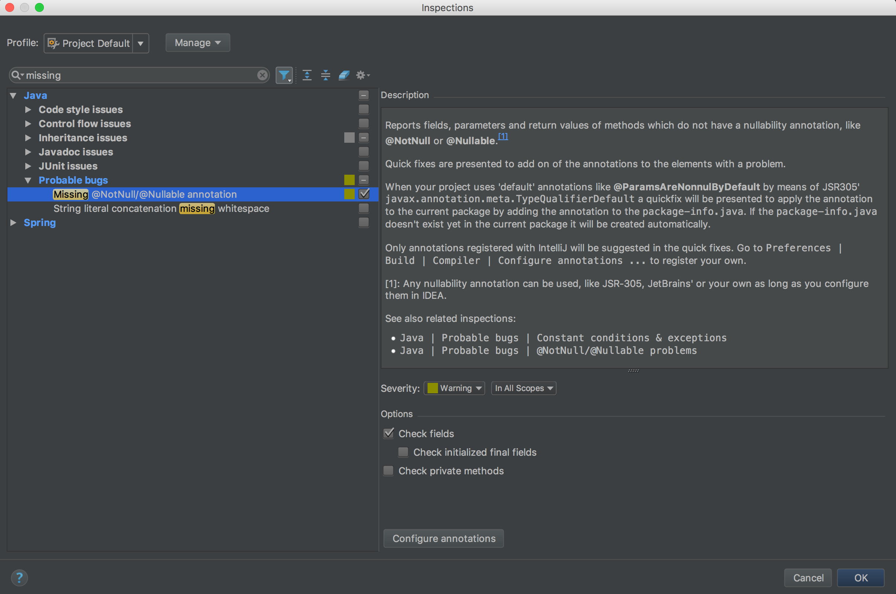

# IntelliJ IDEA nullability annotations inspection

[![Build Status][circleci-img]][circleci-link]
[![Build Status][travis-img]][travis-link]
[![Version][version-img]][plugin-link]
[![Downloads][downloads-img]][plugin-link]
[![Downloads last month][downloads-lm-img]][plugin-link]

Reports fields, parameters and return values of methods which do not have a nullability annotation, 
like **@NotNull** or **@Nullable**.<sup>[1](#fn1)</sup>

Quick fixes are presented to add one of the annotations to the elements with a problem.


You can enable/disable the inspection for fields and private methods via ```Preferences | Editor | Inspections```



When your project uses *default annotations* like **@ParamsAreNonnulByDefault**<sup>[1](#fn1)</sup>
by means of JSR305' ```javax.annotation.meta.TypeQualifierDefault```, a quick fix will be presented to apply 
the annotation to the current package by adding the annotation to the ```package-info.java```.
If a ```package-info.java``` does not exist yet it will be created automatically.

An example of your custom *default annotation* for your project could be something like this:
```java
package com.stylismo.example;

@Documented
@Nonnull
@TypeQualifierDefault({
        ElementType.FIELD,
        ElementType.METHOD,
        ElementType.PARAMETER,
})
@Retention(RUNTIME)
public @interface NonnullByDefault {
}
```

Applying this **@NonnullByDefault** annotation to a package will result in all fields, methods and parameters to be 
non-null, unless an element is annotated with one of the registered **@Nullable** annotations or the method is 
overriding a method in a superclass.
 
By default all redundant annotations will be removed after applying the default annotation to the package. 
See related issue for the details [here](https://github.com/stylismo/nullability-annotations-inspection/issues/1). 

Only annotations registered with IntelliJ will be suggested in the quick fixes.
Go to ```Preferences | Build | Compiler | Configure annotations ...``` to register your own.


[1](): 
Any nullability annotation can be used, like JSR-305, JetBrains' or your own as long as you configure them in IDEA.

[circleci-img]:         https://circleci.com/gh/stylismo/nullability-annotations-inspection.svg?style=shield
[circleci-link]:        https://circleci.com/gh/stylismo/nullability-annotations-inspection
[travis-img]:           https://travis-ci.org/stylismo/nullability-annotations-inspection.svg
[travis-link]:          https://travis-ci.org/stylismo/nullability-annotations-inspection
[version-img]:          http://phpstorm.espend.de/badge/9418/version
[downloads-img]:        http://phpstorm.espend.de/badge/9418/downloads
[downloads-lm-img]:     http://phpstorm.espend.de/badge/9418/last-month
[plugin-link]:          https://plugins.jetbrains.com/plugin/9418